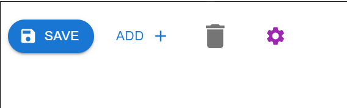

Button component - .

button tag -> 

variant -> 
 - text - grabbing of less attention(card footer), 
 - contained - user attraction (ex: register or login button)
 - outlined -> used for secondary options (Ex: cancelling or go back button)

Props:
 - button with href attribute -> a(anchor) tag.

href="www.google.com"

 - changing the colors

 - colors(refer palette) - primary, secondary, warning, success, info

- size  - small, medium, large

- Icons(components folder) - send, receive

- startIcon -> to add icon at the start
- endIcon -> to add icon at the end

- IconButton from MUI -> to add only icons inside it.
                        color 
                        size  are applicable.
    
    It’s made specifically to create an icon button with no text or label:
    Examples: 

- disableElevation -> some shadow appears on hover, to remove it use this props
- disableRipple -> some splash is going to appear on click on the button, to remove it use this props.

- onClick -> to handle onclick function.

Button Group:  

 variant - provide variant to Button Group 

  - which pass info to all its children buttons.

  props of Button Group:

  orientation - 
  - vertical
  - horizontal (default)

  size -
   - small
   - medium
   - large

   color - 
   - primary
   - secondary
   - success
   - warning
   - info

   onClick - (single onclick instead of all button giving) but single logic to all children buttons

   aria-label - helps accessbility

ToggleButtonGroup 
ToggleButton

  

  props to only ToggleButtonGroup

  - size - small, large, medium

  - color - primary, secondary, success, warning.

  - orientation - vertical, horizontal.

  - exlusive giving to toggleButtonGroup will tell that i want any one to select not all.
    For this you need to update the useState too as string or single value of type instead of array.

    