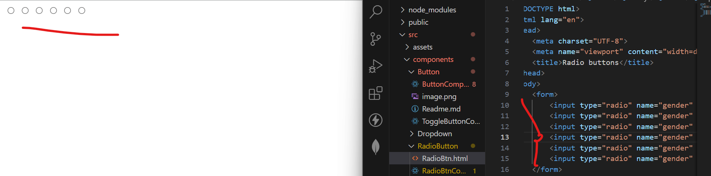

Radio button component.

We need few more components for Radio Btn.

- FormControl-wrapper component, 
- FormLabel-to specify the label of group of buttons

- RadioGroup - which wraps the all radio buttons component.
- FormControlLabel - to label the individual buttons
- Radio.

Props:

row - align in horizontal direction
size - <Radio size="medium" color="primary"/>
error={!value}
FormhelperText

With plain html

